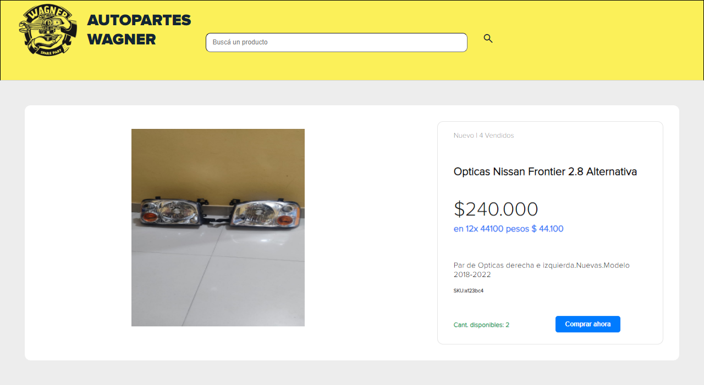
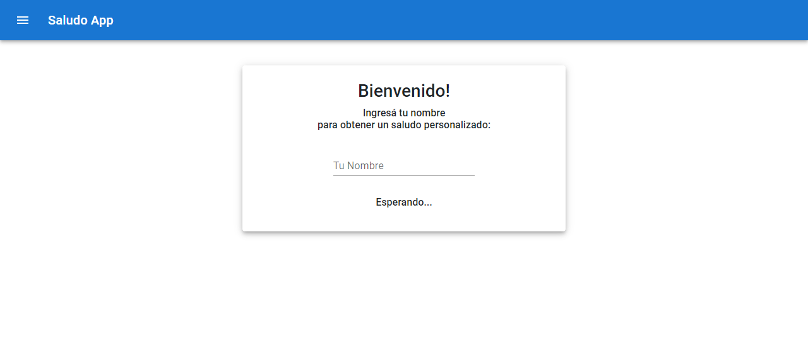
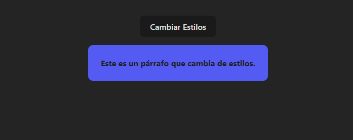
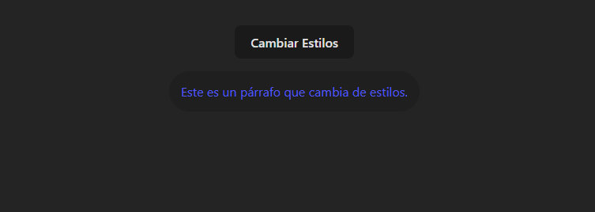
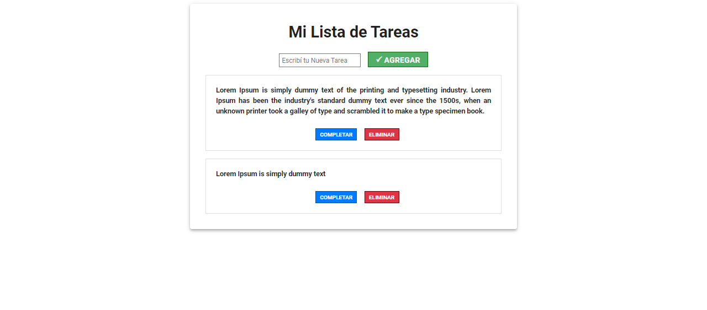

# Proyectos realizados durante la diplomatura de desarrollador web React.js de Argentina Programa 4.0

**Conceptos y tecnologias aprendidos:** `Jsx`, `useState`, `useEffect`, `Material UI`, `Bootstrap`,

1 - 
[CLICK HERE](https://formularioargentinaprograma.netlify.app/).

2 - 
[CLICK HERE](https://autoparteswagner.netlify.app).

3 -
[CLICK HERE](https://react-saludoapp.netlify.app).

4 -
[CLICK HERE](https://cambia-estilos.netlify.app).

5 -
[CLICK HERE](https://listtareasreact.netlify.app).

